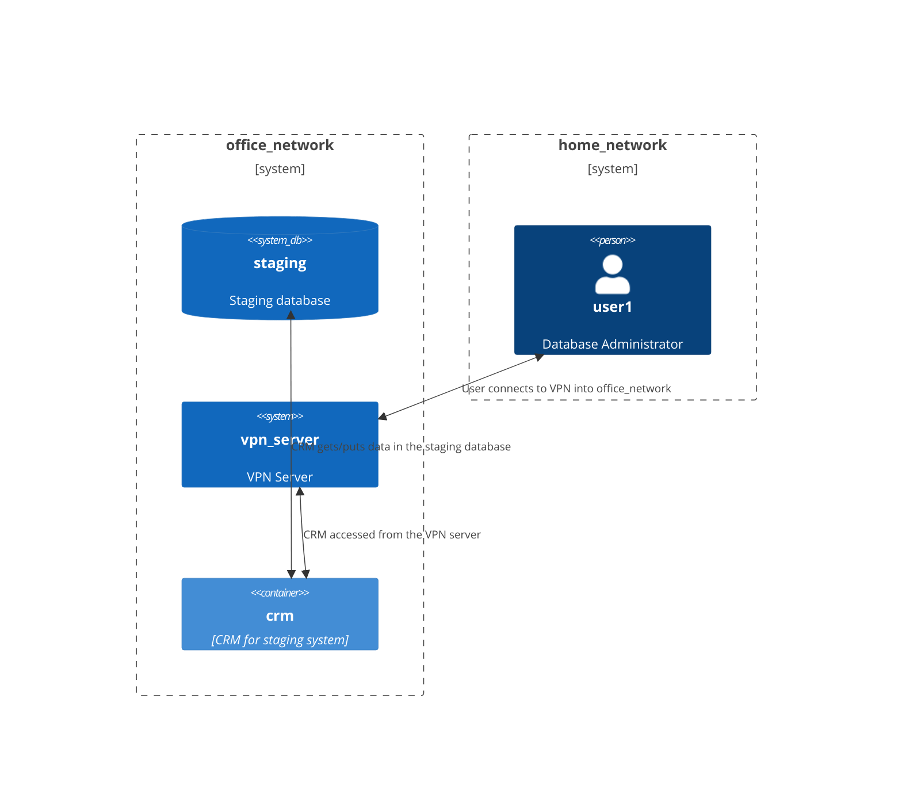

# tmac

Python based threat modelling as code tool (T.M.A.C).

tmac generates a report of a designated workload given a combination of manually created resources, configured checks 
and custom checks.

## Resources

Manual resources can be added to `./docs/resources.json` and should be in the following format.

```
{
  "resources": {
    "networks": [
      {
        "name": "office_network"
      },
      {
        "name": "home_network"
      }
    ],
    "users": [
      {
        "name": "user1",
        "network": "home_network",
        "description": "Database Administrator"
      }
    ],
    "databases": [
      {
        "name": "staging",
        "network": "office_network",
        "description": "Staging database"
      }
    ],
    "systems": [
      {
        "name": "vpn_server",
        "network": "office_network",
        "description": "VPN Server"
      }
    ],
    "containers": [
      {
        "name": "crm",
        "network": "office_network",
        "description": "CRM for staging system"
      }
    ],
    "res_links": [
      {
        "source": "user1",
        "destination": "vpn_server",
        "description": "User connects to VPN into office_network"
      },
      {
        "source": "vpn_server",
        "destination": "crm",
        "description": "CRM accessed from the VPN server"
      },
      {
        "source": "crm",
        "destination": "staging",
        "description": "CRM gets/puts data in the staging database"
      }
    ]
  }
}
```

The above json content will be processed and generate the following DFD (Data Flow Diagram) in Mermaid.




## Configuration

Configuration defines characteristics of a given resource. Default settings for a given resource type can be set in 
`./docs/defaults.json` as follows (following the same format for a resource type).

These settings will be applied to all resources generated. 

```
{
  "networks": {
    "has_wifi": false,
    "is_cloud": false,
    "is_public": false
  },
  "databases": {},
  "users": {},
  "systems": {},
  "containers": {}
}
```

Overides can be set on a per-resource basis, by appending `configs` nested dictionary to the resources.json. The json 
below is based on having `"is_cloud": false` as a default setting - It will create two networks, one with is_cloud set
to `false` (the default), the other (`aws_public_subnet`) will have `is_cloud` set to `true`.

```
{
  "resources": {
    "networks": [
      {
        "name": "internet"
      },
      {
        "name": "aws_public_subnet",
        "config": {
          "is_cloud": true
        }
      }
    ]
  }
}
```

## Checks

Custom checks can be written and added to `./docs/security_checks.json`. These files should be written as below, the 
checks are iterated over and executed individually, all fields are required.

```
{
  "user_owned_device": {
    "name": "Non company device used",
    "description": "Checks for users with company_user true and company_device false.",
    "remediation": "Understand and remediate or document known exception.",
    "severity": 3,
    "resource_scope": "users",
    "check_query": "resources[resource][\"company_user\"] and not resources[resource][\"company_device\"]"
  }
}
```

## Outputs

The primary output of tmac is a generated Markdown report, including a DFD (Data Flow Diagram) generated from the 
provided resources, and a programmatically generated list of security concerns using fields from the configuration
(including overrides).

Additionally, a json report is generated of all resources and their config - To ease reviewing the findings during a 
threat modelling session.