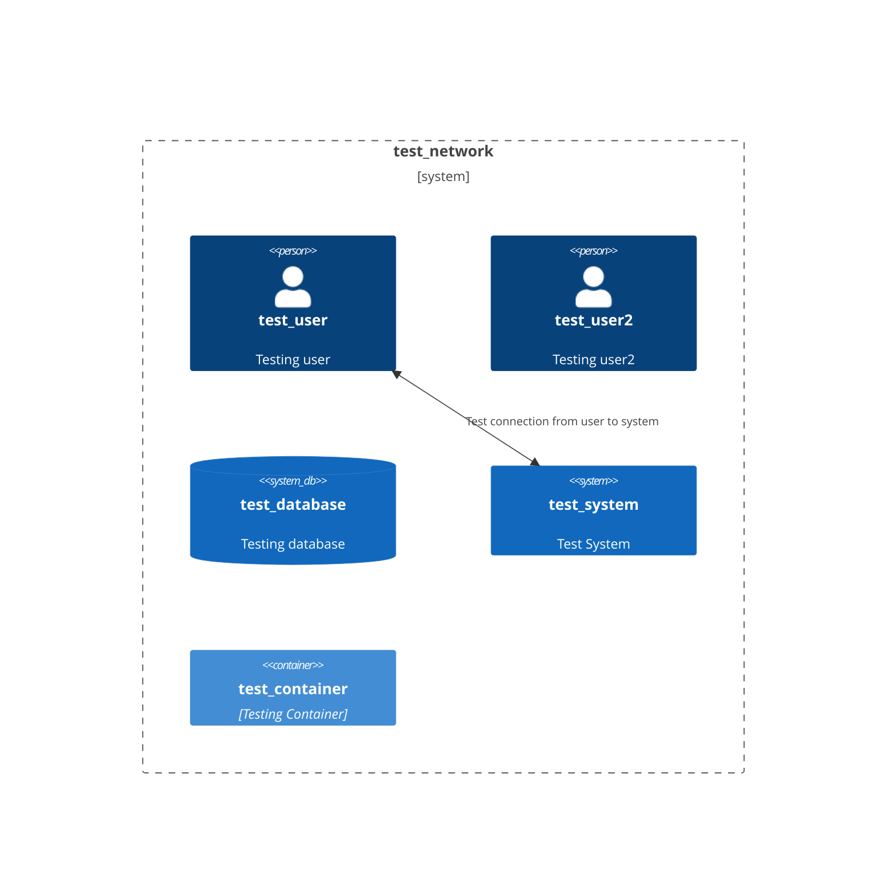

# test_doc
Threat modelling for test

# Data Flow Diagram

| Name | Resources | Finding | Remediation | Severity |
|-----|-----|-----|-----|-----|
| Non company device used | test_user2 | Checks for users with company_user true and company_device false. | Understand and remediate or document known exception. | 3 | 