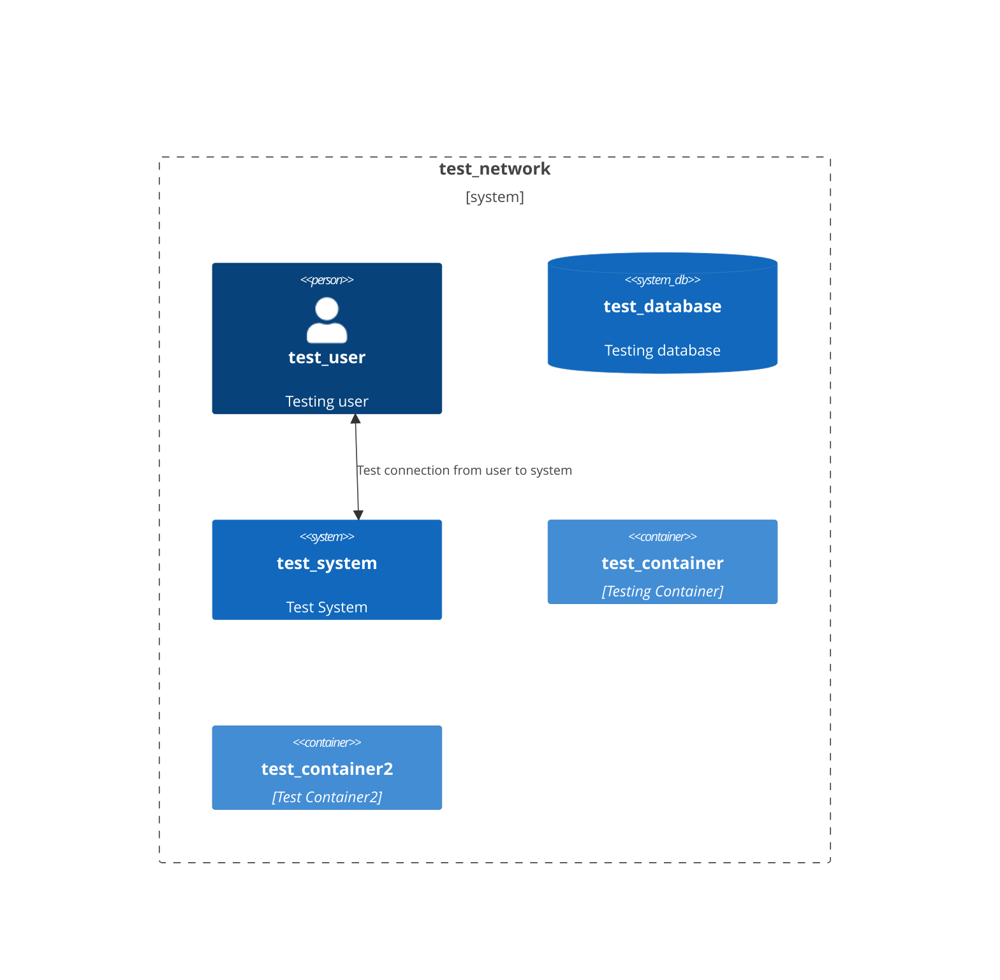

# test_doc
Threat modelling for test

# Data Flow Diagram

```mermaid
C4Context
	Boundary(btest_network, "test_network") {
		Person(test_user, "test_user", "Testing user")
		SystemDb(test_database,"test_database ", "Testing database")
		System(test_system,"test_system ", "Test System")
		Container(test_container,"test_container ", "Testing Container")
		Container(test_container2,"test_container2 ", "Test Container2")
	}
	BiRel(test_user,test_system, "Test connection from user to system")

UpdateLayoutConfig($c4ShapeInRow="2", $c4BoundaryInRow="3")
```
