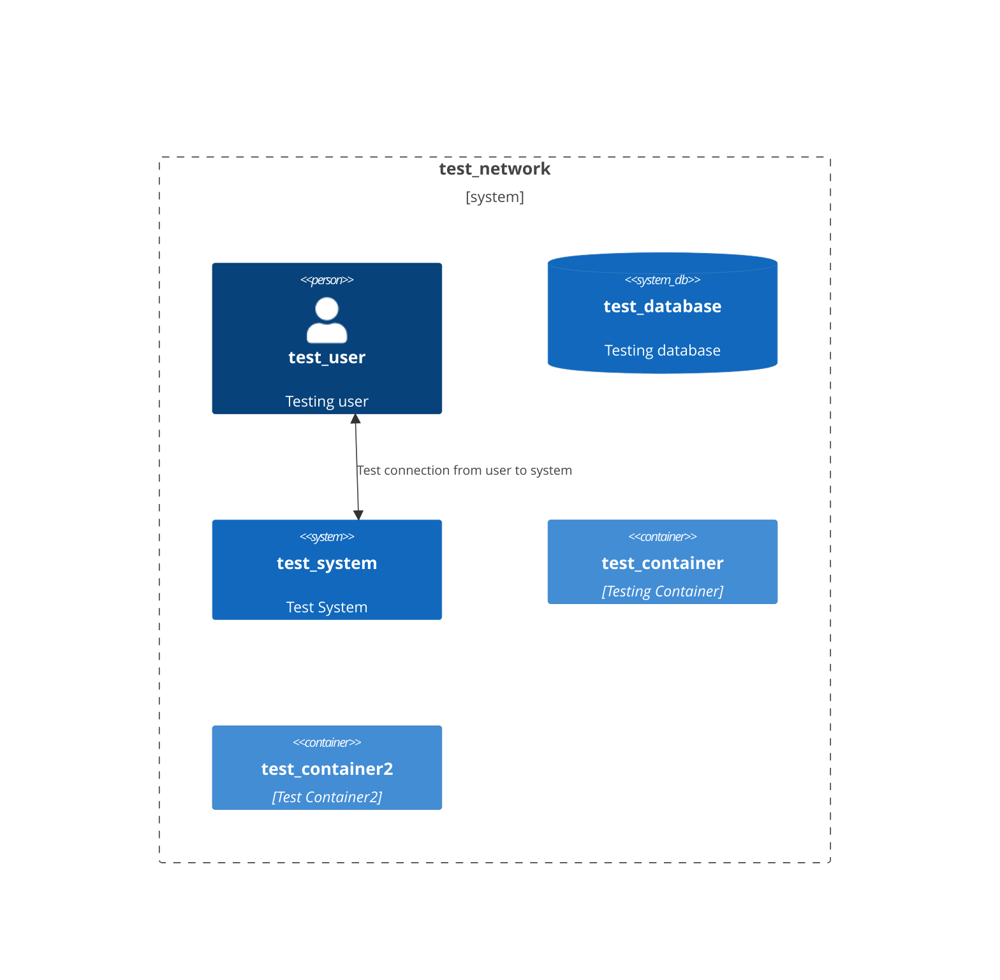

# test_doc
Threat modelling for test

# Data Flow Diagram

| Name | Resources | Finding | Remediation | Severity |
|-----|-----|-----|-----|-----|
| A01:2021-Broken Access Control | test_system | OWASP top 10 #1: Checks for combination of controls that indicate lack of mitigation against this type of attack | Review non-compliant controls and remediate | 1 | | A01:2021-Broken Access Control | test_container | OWASP top 10 #1: Checks for combination of controls that indicate lack of mitigation against this type of attack | Review non-compliant controls and remediate | 1 | | A01:2021-Broken Access Control | test_container2 | OWASP top 10 #1: Checks for combination of controls that indicate lack of mitigation against this type of attack | Review non-compliant controls and remediate | 1 | 