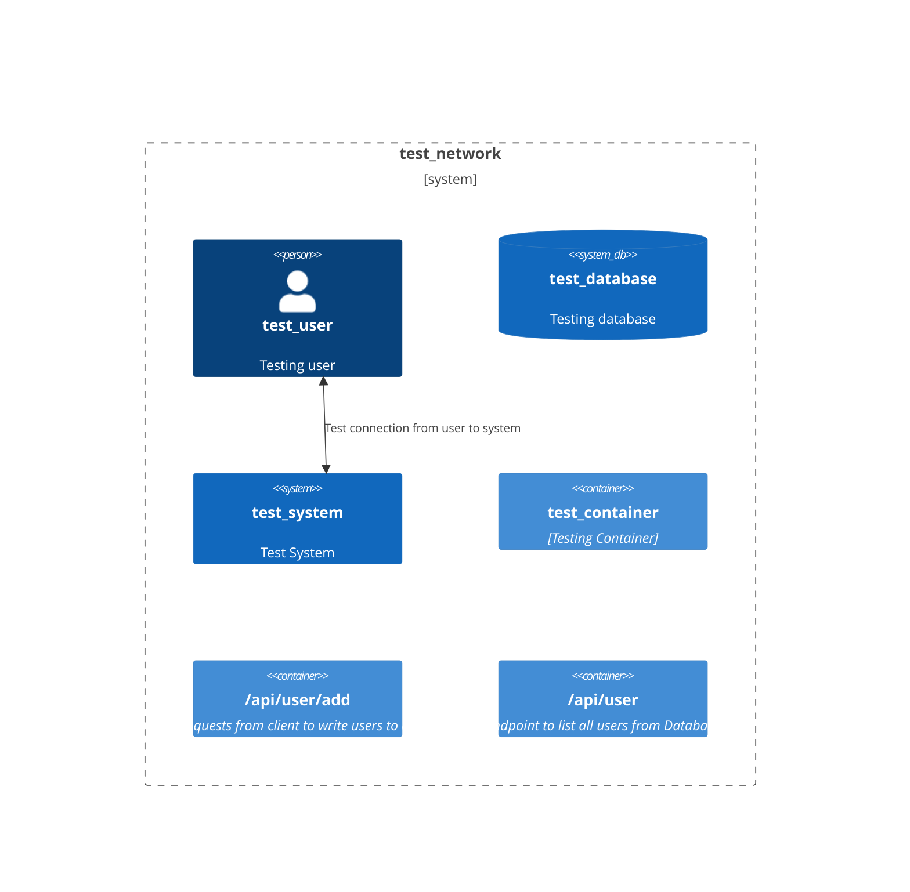

# test_doc
Threat modelling for test

# Data Flow Diagram

| Name | Resources | Finding | Remediation | Severity |
|-----|-----|-----|-----|-----|
| A01:2021-Broken Access Control | test_system | OWASP top 10 #1: Checks for combination of controls that indicate lack of mitigation against this type of attack | Review non-compliant controls and remediate | 1 | 
| A01:2021-Broken Access Control | test_container | OWASP top 10 #1: Checks for combination of controls that indicate lack of mitigation against this type of attack | Review non-compliant controls and remediate | 1 | 
| A01:2021-Broken Access Control | /api/user/add | OWASP top 10 #1: Checks for combination of controls that indicate lack of mitigation against this type of attack | Review non-compliant controls and remediate | 1 | 
| A01:2021-Broken Access Control | /api/user | OWASP top 10 #1: Checks for combination of controls that indicate lack of mitigation against this type of attack | Review non-compliant controls and remediate | 1 | 
| A02:2021-Cryptographic_Failures | test_database | OWASP top 10 #2: Checks for various items related to encryption | Review non-compliant controls and remediate | 1 | 
| A03:2021 – Injection | test_system | OWASP top 10 #3: Checks for mitigations against SQL injection | Review non-compliant controls and remediate | 1 | 
| A03:2021 – Injection | test_container | OWASP top 10 #3: Checks for mitigations against SQL injection | Review non-compliant controls and remediate | 1 | 
| A03:2021 – Injection | /api/user/add | OWASP top 10 #3: Checks for mitigations against SQL injection | Review non-compliant controls and remediate | 1 | 
| A03:2021 – Injection | /api/user | OWASP top 10 #3: Checks for mitigations against SQL injection | Review non-compliant controls and remediate | 1 | 
